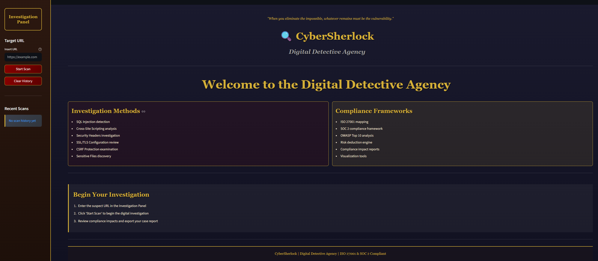
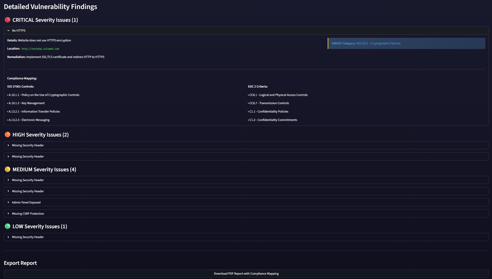
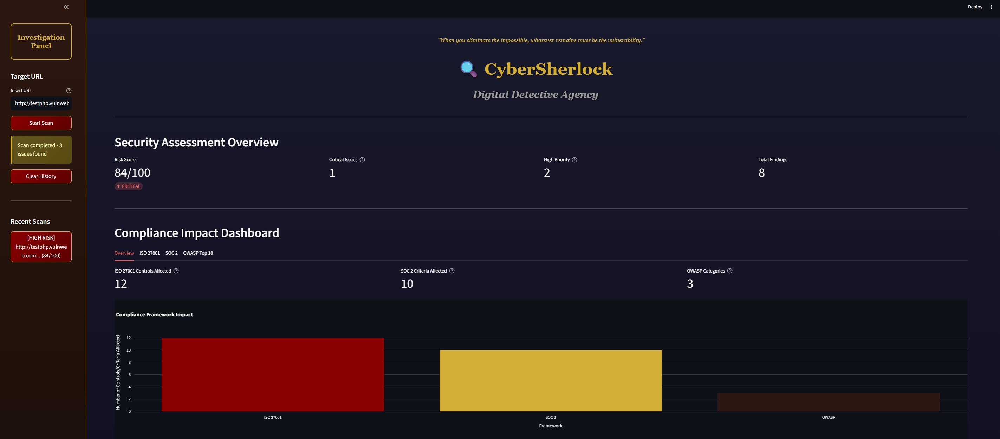
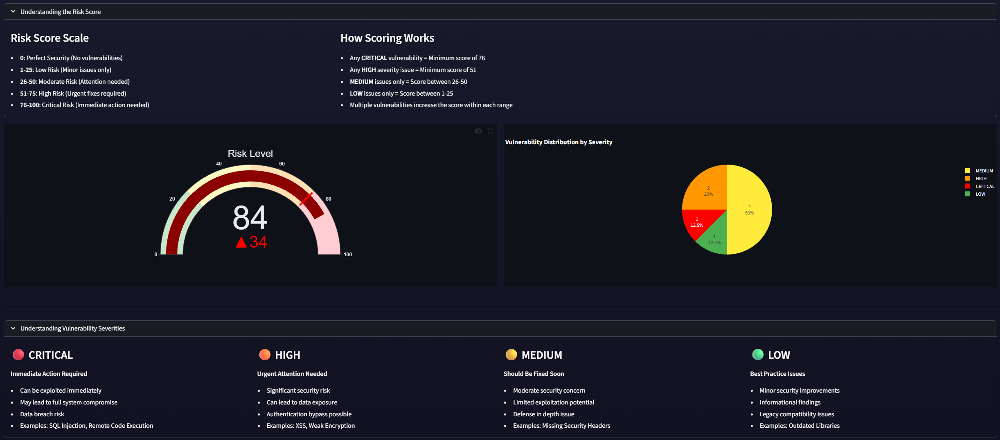

# 🔍 CyberSherlock: Web Vulnerability & Compliance Scanner


A dynamic web application security scanner built in Python, featuring a **Streamlit dashboard**, **PDF reporting**, and integrated **compliance mapping** for **ISO 27001** and **SOC 2**.

This tool is designed to provide actionable security insights by identifying common vulnerabilities and mapping them directly to relevant GRC (Governance, Risk, and Compliance) controls.

---

## Dashboard preview

The project features a full web-based GUI built with Streamlit, designed with a custom theme.


---

## Key features

* **Dual Interface:** Run scans via a simple **Command-Line Interface (CLI)** or an interactive **Streamlit Web Dashboard**.
* Detects a wide range of vulnerabilities:
    * SQL Injection (SQLi) 
    * Cross-Site Scripting (XSS) 
    * Missing/Insecure Security Headers 
    * Weak SSL/TLS Configuration 
    * Missing CSRF Protection 
    * Sensitive File Exposure
* **Advanced risk scoring:** Implements a custom algorithm to generate a **0-100 risk score**
* **Compliance-driven reporting:** Maps vulnerabilities directly to specific **ISO 27001** controls and **SOC 2** compliance framework .
* **PDF report:** Generates detailed PDF report directly from the dashboard, complete with vulnerability details, remediation steps, and compliance impact summaries.

---

## Compliance mapping

This project's core differentiator is its focus on GRC. By mapping technical vulnerabilities to business-facing compliance standards, CyberSherlock bridges the gap between security operations and risk management.

### Frameworks covered

* **OWASP Top 10 (2021):**
    * `A01:2021` - Broken Access Control 
    * `A02:2021` - Cryptographic Failures 
    * `A03:2021` - Injection 
    * `A05:2021` - Security Misconfiguration
  
* **ISO 27001 Controls:**
    * `A.9.4.1` - Information Access Restriction
    * `A.10.1.1` - Policy on Cryptographic Controls
    * `A.12.6.1` - Management of Technical Vulnerabilities
    * `A.14.2.5` - Secure System Engineering Principles
    * *(and 14 more controls)*
* **SOC 2 Trust Services Criteria:**
    * `CC6.1` - Logical and Physical Access Controls
    * `CC6.6` - System Operations
    * `CC6.7` - Transmission Controls
    * `C1.1` - Confidentiality Policies
    * `PI1.1` - Processing Integrity
    * *(and 7 more criteria)*


---

## Installation & usage

### 1. Prerequisites

* Python 3.9 or newer
* Git

### 2. Clone & install

Clone the repository and install the required packages using `requirements.txt`.

```bash
# Clone the repository
git clone [https://github.com/sandr66/CyberSherlock.git](https://github.com/sandr66/CyberSherlock.git)
cd CyberSherlock

# Create a virtual environment
python -m venv venv
source venv/bin/activate 

# Install dependencies
pip install -r requirements.txt
```

### 3. Running the dashboard 

To launch the interactive Streamlit dashboard, run:

```bash
streamlit run vulnerability_scanner.py
```

Your browser will automatically open to the CyberSherlock dashboard.


### 4. Running the CLI

For quick scans or use in automated scripts, use the CLI mode.

```bash
python vulnerability_scanner.py
```

The tool will prompt you for a target URL and save two files: `scan_results.json` and `scan_report.md`.

---

## How it works: Technical deep-dive

### 1. Scanning methodology

The scanner uses a `requests.Session` object to perform non-intrusive checks.

| Vulnerability | Methodology                                                                                                                                                                                                                |
| :--- |:---------------------------------------------------------------------------------------------------------------------------------------------------------------------------------------------------------------------------|
| **SQL Injection** | Appends common SQL payloads (`' OR '1'='1`, `admin'--`, etc.) to URL parameters. Detects vulnerabilities by checking the response for known SQL database error strings (e.g., "SQL syntax", "mysql_fetch")                 |
| **XSS** | Injects common XSS payloads (e.g., `<script>alert(1)</script>`, ``) into URL parameters. A vulnerability is flagged if the payload is reflected back in the HTML response without sanitization |
| **Security Headers** | Makes a GET request and inspects the response headers. Flags the *absence* of critical headers like `Content-Security-Policy`, `Strict-Transport-Security`, and `X-Frame-Options`                                          |
| **SSL/TLS** | Checks if the site uses `https://`. If so, it connects to port 443 to validate the certificate and check for outdated protocols (e.g., TLSv1, TLSv1.1), flagging them as high-risk                                         |
| **CSRF** | Parses the page's HTML with `BeautifulSoup` to find all `<form>` tags. It then inspects forms with `method="POST"` to ensure they contain an `<input>` field with a name like `csrf` or `token`                            |
| **Info Disclosure** | Probes for common sensitive paths (e.g., `/.git/config`, `/.env`, `/admin/`). A `200` status code, along with content verification (like `[core]` in `.git/config`), confirms a finding                                    |

### 2. Risk scoring algorithm

The 0-100 risk score is calculated using a weighted algorithm based on the **highest severity finding**.

1.  **Baseline score:** 0 (perfect).
2.  **Severity jump:** The score baseline is set by the *highest* severity vulnerability found:
    * **Critical Issue:** Minimum score of 76
    * **High Issue:** Minimum score of 51
    * **Medium Issue:** Minimum score of 26
    * **Low Issue:** Minimum score of 1
3.  **Volume-based increase:** Additional points are added for *each* vulnerability within that range (e.g., +8 for each critical, +6 for medium), up to a cap.
4.  **Final score:** The final score is capped at 100.

This model ensures that a single critical vulnerability (like SQLi) is always treated as more severe than 10 low-level issues (like missing headers).



---

## License

This project is licensed under the MIT License.
